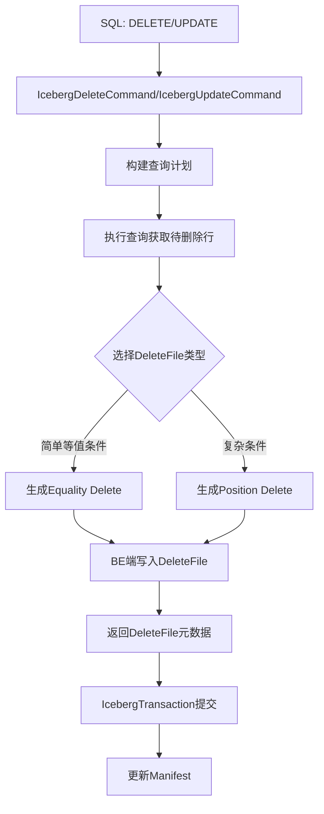

# Iceberg Update 和 Delete 设计文档

## 1. 概述

本文档描述如何在 Apache Doris 中实现 Iceberg 表的 UPDATE 和 DELETE 操作。Iceberg 表使用 DeleteFile 机制来标记删除的行，UPDATE 操作通过 DELETE + INSERT 的方式实现。

## 2. 现有架构分析

### 2.1 FE 端架构

#### 2.1.1 命令层

- **DeleteFromCommand** (`fe/fe-core/src/main/java/org/apache/doris/nereids/trees/plans/commands/DeleteFromCommand.java`): 处理 OLAP 表的 DELETE 操作
- **UpdateCommand** (`fe/fe-core/src/main/java/org/apache/doris/nereids/trees/plans/commands/UpdateCommand.java`): 处理 OLAP 表的 UPDATE 操作，转换为 INSERT 操作
- **InsertIntoTableCommand** (`fe/fe-core/src/main/java/org/apache/doris/nereids/trees/plans/commands/insert/InsertIntoTableCommand.java`): 统一的 INSERT 命令入口

#### 2.1.2 Iceberg 相关组件

- **IcebergInsertExecutor** (`fe/fe-core/src/main/java/org/apache/doris/nereids/trees/plans/commands/insert/IcebergInsertExecutor.java`): Iceberg 表插入执行器
- **IcebergTransaction** (`fe/fe-core/src/main/java/org/apache/doris/datasource/iceberg/IcebergTransaction.java`): 管理 Iceberg 事务，支持 AppendFiles、OverwriteFiles、ReplacePartitions、RewriteFiles
- **IcebergTableSink** (`fe/fe-core/src/main/java/org/apache/doris/planner/IcebergTableSink.java`): Iceberg 表写入节点
- **IcebergInsertCommandContext** (`fe/fe-core/src/main/java/org/apache/doris/nereids/trees/plans/commands/insert/IcebergInsertCommandContext.java`): Iceberg 插入上下文

#### 2.1.3 DML 命令类型

- **DMLCommandType** (`fe/fe-core/src/main/java/org/apache/doris/nereids/trees/plans/commands/info/DMLCommandType.java`): 定义了 INSERT、UPDATE、DELETE 等类型

### 2.2 BE 端架构

#### 2.2.1 读取层

- **IcebergTableReader** (`be/src/vec/exec/format/table/iceberg_reader.h`): 支持读取 Position Delete 和 Equality Delete 文件
- **DeleteFileIndex** (`fe/fe-core/src/main/java/org/apache/iceberg/DeleteFileIndex.java`): DeleteFile 索引，用于快速查找需要应用的删除文件

### 2.3 Iceberg DeleteFile 机制

Iceberg 支持两种类型的 DeleteFile：

1. **Position Delete**: 通过文件路径和行位置删除特定行
2. **Equality Delete**: 通过等值条件删除匹配的行

## 3. 设计方案

### 3.1 DELETE 操作设计

#### 3.1.1 命令层实现

创建 `IcebergDeleteCommand`，参考 `DeleteFromCommand` 的实现：

**文件路径**: `fe/fe-core/src/main/java/org/apache/doris/nereids/trees/plans/commands/IcebergDeleteCommand.java`

**主要功能**:

1. 解析 DELETE 语句的 WHERE 条件
2. 构建查询计划，扫描需要删除的行
3. 生成 DeleteFile（优先使用 Equality Delete，如果条件复杂则使用 Position Delete）
4. 提交 DeleteFile 到 Iceberg 表

**关键实现点**:

- 检查目标表是否为 Iceberg 表
- 将 DELETE 转换为 SELECT 查询，获取需要删除的行
- 根据 WHERE 条件复杂度选择 DeleteFile 类型
- 使用 IcebergTransaction 提交删除操作

#### 3.1.2 执行器实现

创建 `IcebergDeleteExecutor`，参考 `IcebergInsertExecutor`：

**文件路径**: `fe/fe-core/src/main/java/org/apache/doris/nereids/trees/plans/commands/delete/IcebergDeleteExecutor.java`

**主要功能**:

1. 管理 DELETE 事务
2. 收集需要删除的行数据
3. 生成 DeleteFile
4. 提交到 Iceberg 表

#### 3.1.3 事务扩展

扩展 `IcebergTransaction`，添加删除相关方法：

**修改文件**: `fe/fe-core/src/main/java/org/apache/doris/datasource/iceberg/IcebergTransaction.java`

**新增方法**:

```java
public void beginDelete(ExternalTable dorisTable, Optional<DeleteCommandContext> ctx)
public void finishDelete(NameMapping nameMapping)
private void updateManifestAfterDelete(List<DeleteFile> deleteFiles)
```

**实现逻辑**:

- 使用 `OverwriteFiles` API 添加 DeleteFile
- 支持 Position Delete 和 Equality Delete
- 处理分区过滤

#### 3.1.4 BE 端 DeleteFile 写入

**需要实现的功能**:

1. 在 BE 端生成 DeleteFile（Parquet/ORC 格式）
2. 写入 DeleteFile 到存储系统
3. 返回 DeleteFile 元数据给 FE

**关键文件**:

- `be/src/vec/exec/format/table/iceberg_writer.h` (需要创建)
- `be/src/vec/exec/format/table/iceberg_delete_file_writer.h` (需要创建)

### 3.2 UPDATE 操作设计

#### 3.2.1 命令层实现

创建 `IcebergUpdateCommand`，参考 `UpdateCommand` 的实现：

**文件路径**: `fe/fe-core/src/main/java/org/apache/doris/nereids/trees/plans/commands/IcebergUpdateCommand.java`

**主要功能**:

1. 解析 UPDATE 语句的 SET 子句和 WHERE 条件
2. 将 UPDATE 转换为 DELETE + INSERT 操作
3. 先删除旧行（生成 DeleteFile）
4. 再插入新行（使用现有 INSERT 逻辑）

**实现策略**:

- UPDATE 操作分解为两个步骤：

  1. DELETE: 删除满足 WHERE 条件的行
  2. INSERT: 插入更新后的行数据

- 使用事务保证原子性

#### 3.2.2 执行器实现

可以复用 `IcebergDeleteExecutor` 和 `IcebergInsertExecutor`，或者创建 `IcebergUpdateExecutor` 来协调两个操作。

### 3.3 DeleteFile 生成策略

#### 3.3.1 Equality Delete

**适用场景**:

- WHERE 条件包含等值比较（=, IN）
- 涉及的列数量较少（建议 ≤ 5 列）
- 删除的行数适中

**实现方式**:

1. 扫描数据文件，应用 WHERE 条件过滤
2. 提取匹配行的等值列值
3. 生成 Equality Delete 文件，包含等值列数据
4. 使用 Iceberg 的 `OverwriteFiles` API 添加 DeleteFile

#### 3.3.2 Position Delete

**适用场景**:

- WHERE 条件复杂（包含范围比较、函数等）
- 删除的行数较少
- Equality Delete 不适用的情况

**实现方式**:

1. 扫描数据文件，应用 WHERE 条件过滤
2. 记录匹配行的文件路径和行位置
3. 生成 Position Delete 文件，包含 (file_path, pos) 对
4. 使用 Iceberg 的 `OverwriteFiles` API 添加 DeleteFile

### 3.4 数据流设计



## 4. 实现细节

### 4.1 FE 端实现步骤

#### 步骤 1: 创建 IcebergDeleteCommand

参考 `DeleteFromCommand.java`，主要修改：

- 检查表类型为 IcebergExternalTable
- 构建查询计划时使用 IcebergScanNode
- 创建 UnboundIcebergDeleteSink 节点

#### 步骤 2: 创建 IcebergDeleteExecutor

参考 `IcebergInsertExecutor.java`，主要修改：

- 继承 `BaseExternalTableInsertExecutor`
- 实现 `beginDelete()` 和 `finishDelete()` 方法
- 管理 DeleteFile 的生成和提交

#### 步骤 3: 扩展 IcebergTransaction

在 `IcebergTransaction.java` 中添加删除相关方法：

- `beginDelete()`: 初始化删除事务
- `finishDelete()`: 提交 DeleteFile
- `updateManifestAfterDelete()`: 使用 OverwriteFiles API 添加 DeleteFile

#### 步骤 4: 创建 DeleteCommandContext

创建 `fe/fe-core/src/main/java/org/apache/doris/nereids/trees/plans/commands/delete/DeleteCommandContext.java`：

- 存储删除操作的上下文信息
- 包含 DeleteFile 类型选择策略
- 存储分区过滤信息

#### 步骤 5: 创建 UnboundIcebergDeleteSink

创建 `fe/fe-core/src/main/java/org/apache/doris/nereids/analyzer/UnboundIcebergDeleteSink.java`：

- 类似于 `UnboundIcebergTableSink`
- 用于表示 DELETE 操作的 Sink 节点

#### 步骤 6: 创建 PhysicalIcebergDeleteSink

创建 `fe/fe-core/src/main/java/org/apache/doris/nereids/trees/plans/physical/PhysicalIcebergDeleteSink.java`：

- 物理计划节点
- 绑定到 `IcebergDeleteTableSink`

#### 步骤 7: 创建 IcebergDeleteTableSink

创建 `fe/fe-core/src/main/java/org/apache/doris/planner/IcebergDeleteTableSink.java`：

- 类似于 `IcebergTableSink`
- 绑定删除相关的元数据信息

### 4.2 UPDATE 操作实现步骤

#### 步骤 1: 创建 IcebergUpdateCommand

参考 `UpdateCommand.java`，主要修改：

- 检查表类型为 IcebergExternalTable
- 将 UPDATE 分解为 DELETE + INSERT
- 使用事务保证原子性

#### 步骤 2: 创建 IcebergUpdateExecutor

创建 `fe/fe-core/src/main/java/org/apache/doris/nereids/trees/plans/commands/update/IcebergUpdateExecutor.java`：

- 协调 DELETE 和 INSERT 操作
- 确保事务的原子性
- 处理错误回滚

### 4.3 BE 端实现步骤

#### 步骤 1: 创建 IcebergDeleteFileWriter

创建 `be/src/vec/exec/format/table/iceberg_delete_file_writer.h` 和 `.cpp`：

- 支持写入 Position Delete 文件
- 支持写入 Equality Delete 文件
- 生成 DeleteFile 元数据

#### 步骤 2: 扩展 IcebergTableSink (BE)

修改 BE 端的 Iceberg 写入逻辑：

- 在 `iceberg_table_sink.cpp` 中添加 DeleteFile 写入支持
- 处理 DeleteFile 的序列化和写入

#### 步骤 3: 添加 Thrift 定义

在 `gensrc/thrift/DataSinks.thrift` 中添加：

- `TIcebergDeleteTableSink`: Delete 操作的 Sink 定义
- `TIcebergDeleteFile`: DeleteFile 元数据结构

## 5. 关键代码实现

### 5.1 IcebergDeleteCommand 核心逻辑

```java
public class IcebergDeleteCommand extends Command {
    @Override
    public void run(ConnectContext ctx, StmtExecutor executor) {
        // 1. 检查表类型
        IcebergExternalTable table = checkAndGetIcebergTable(ctx);
        
        // 2. 构建查询计划
        LogicalPlan queryPlan = buildDeleteQueryPlan(ctx, logicalQuery);
        
        // 3. 选择 DeleteFile 类型
        DeleteFileType deleteFileType = chooseDeleteFileType(queryPlan);
        
        // 4. 执行删除操作
        IcebergDeleteExecutor deleteExecutor = new IcebergDeleteExecutor(
            ctx, table, labelName, planner, deleteFileType, jobId);
        deleteExecutor.execute();
    }
    
    private DeleteFileType chooseDeleteFileType(LogicalPlan queryPlan) {
        // 分析 WHERE 条件复杂度
        // 简单等值条件 -> Equality Delete
        // 复杂条件 -> Position Delete
    }
}
```

### 5.2 IcebergTransaction 删除方法

```java
public class IcebergTransaction {
    public void beginDelete(ExternalTable dorisTable, Optional<DeleteCommandContext> ctx) {
        this.table = IcebergUtils.getIcebergTable(dorisTable);
        this.transaction = table.newTransaction();
        this.deleteCtx = ctx;
    }
    
    public void finishDelete(NameMapping nameMapping) {
        List<DeleteFile> deleteFiles = collectDeleteFiles();
        updateManifestAfterDelete(deleteFiles);
    }
    
    private void updateManifestAfterDelete(List<DeleteFile> deleteFiles) {
        OverwriteFiles overwriteFiles = transaction.newOverwrite();
        overwriteFiles = overwriteFiles.scanManifestsWith(ops.getThreadPoolWithPreAuth());
        
        // 添加 DeleteFile
        for (DeleteFile deleteFile : deleteFiles) {
            overwriteFiles.addDeleteFile(deleteFile);
        }
        
        overwriteFiles.commit();
    }
}
```

### 5.3 BE 端 DeleteFile 写入

```cpp
class IcebergDeleteFileWriter {
public:
    Status write_position_delete(const std::vector<PositionDelete>& deletes);
    Status write_equality_delete(const std::vector<EqualityDelete>& deletes);
    DeleteFileMetadata finish();
};
```

## 6. 测试计划

### 6.1 单元测试

1. **IcebergDeleteCommandTest**: 测试 DELETE 命令解析和计划生成
2. **IcebergUpdateCommandTest**: 测试 UPDATE 命令转换
3. **IcebergTransactionTest**: 测试删除事务管理
4. **DeleteFileWriterTest**: 测试 DeleteFile 写入逻辑

### 6.2 集成测试

1. **DELETE 操作测试**:

   - 简单等值条件删除
   - 复杂条件删除
   - 分区表删除
   - 大批量删除

2. **UPDATE 操作测试**:

   - 单行更新
   - 批量更新
   - 分区表更新
   - 事务回滚测试

3. **性能测试**:

   - DeleteFile 生成性能
   - 大规模删除性能
   - 并发删除测试

## 7. 注意事项

### 7.1 兼容性

- 确保与现有 Iceberg 表格式兼容
- 支持 Iceberg v1 和 v2 格式
- 兼容不同的文件格式（Parquet、ORC）

### 7.2 性能优化

- DeleteFile 大小控制（避免单个文件过大）
- 批量删除优化
- 分区剪枝优化

### 7.3 错误处理

- 事务回滚机制
- DeleteFile 写入失败处理
- 网络异常处理

### 7.4 限制

- 初始版本可能不支持跨分区删除
- 复杂 JOIN 条件的 DELETE 可能性能较差
- 需要 Iceberg 表支持 DeleteFile（v2 格式）

## 8. 后续优化

1. **Merge-on-Read 优化**: 优化 DeleteFile 读取性能
2. **Compaction 集成**: 自动触发 Compaction 合并 DeleteFile
3. **增量删除**: 支持增量删除操作
4. **删除统计**: 提供删除操作的统计信息

## 9. 参考文档

- [Iceberg Delete Files Specification](https://iceberg.apache.org/spec/#delete-files)
- [Apache Doris Iceberg Integration](https://doris.apache.org/docs/dev/lakehouse/iceberg/)
- [Iceberg Java API Documentation](https://iceberg.apache.org/javadoc/latest/)

## 10. 总结

本文档详细描述了在 Apache Doris 中实现 Iceberg 表的 UPDATE 和 DELETE 操作的完整设计方案。核心思路是：

1. **DELETE 操作**: 通过生成 DeleteFile（Position Delete 或 Equality Delete）来标记删除的行
2. **UPDATE 操作**: 通过 DELETE + INSERT 的方式实现，使用事务保证原子性
3. **实现层次**: FE 端负责计划生成和事务管理，BE 端负责 DeleteFile 的生成和写入

该设计充分利用了 Iceberg 的 DeleteFile 机制，避免了重写数据文件，提高了删除和更新操作的效率。