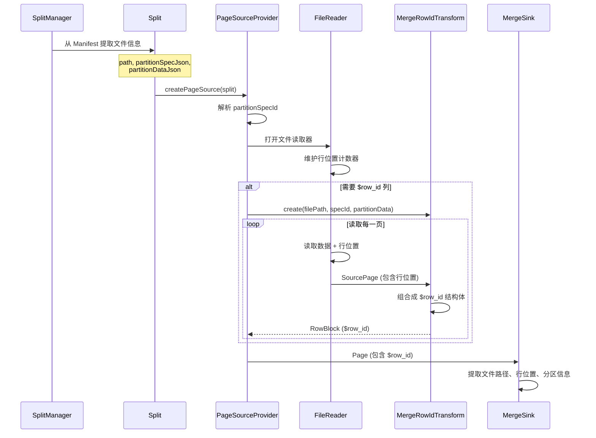
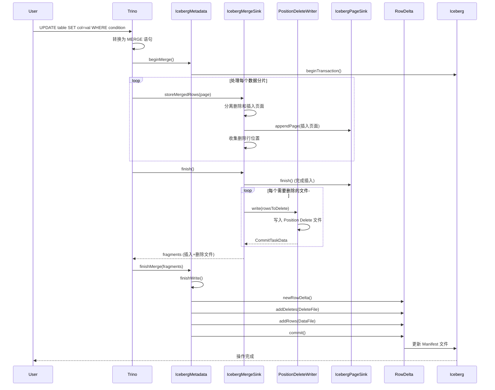
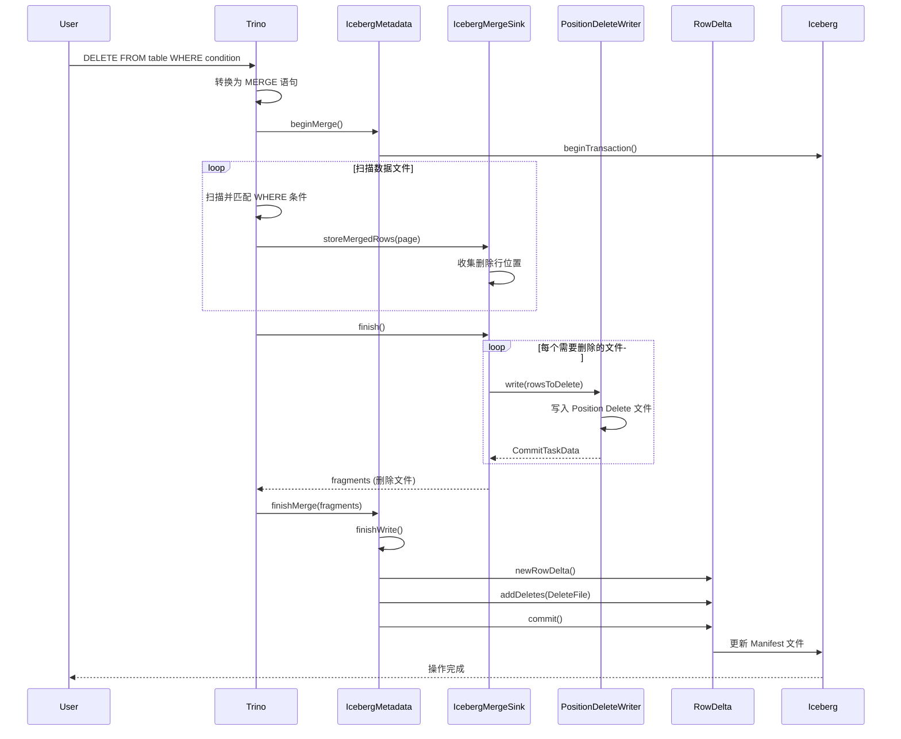
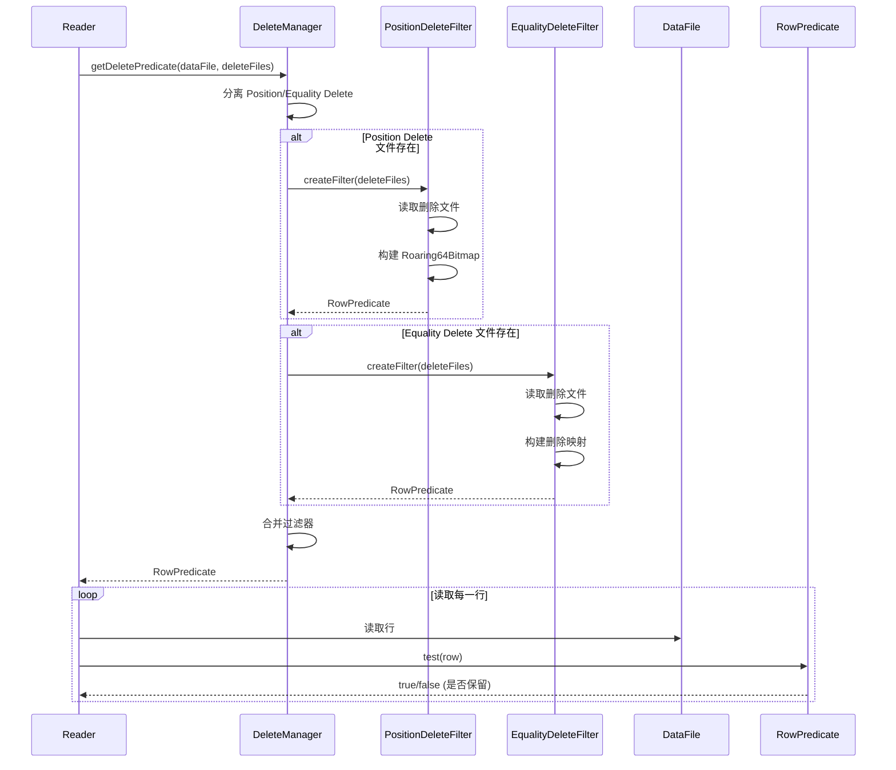

# Trino Iceberg Update 和 Delete 原理与代码调用流程详解

## 1. 概述

Trino 通过 **MERGE** 语句来实现 Iceberg 表的 UPDATE 和 DELETE 操作。与传统的直接修改数据文件不同，Iceberg 使用 **DeleteFile** 机制来标记删除的行，UPDATE 操作通过 DELETE + INSERT 的方式实现。这种设计避免了重写整个数据文件，提高了操作的效率。

### 1.1 核心概念

- **Position Delete**: 通过文件路径和行位置（file_path, pos）来标记删除的行
- **Equality Delete**: 通过等值条件（特定列的值）来标记删除的行
- **RowDelta**: Iceberg 的事务 API，用于提交 DeleteFile 和数据文件
- **Merge Operation**: Trino 将 UPDATE/DELETE 转换为 MERGE 操作

## 2. 架构设计

### 2.1 核心组件

```
┌─────────────────────────────────────────────────────────────┐
│                    Trino Query Engine                        │
├─────────────────────────────────────────────────────────────┤
│  SQL Parser → Logical Plan → Physical Plan → Execution      │
└─────────────────────────────────────────────────────────────┘
                            │
                            ▼
┌─────────────────────────────────────────────────────────────┐
│              Iceberg Connector (Plugin)                      │
├─────────────────────────────────────────────────────────────┤
│  IcebergMetadata                                            │
│    ├── beginMerge()                                         │
│    ├── finishMerge()                                        │
│    └── finishWrite()                                        │
│                                                              │
│  IcebergMergeSink                                           │
│    ├── storeMergedRows()                                    │
│    └── finish()                                             │
│                                                              │
│  PositionDeleteWriter                                       │
│    └── write()                                              │
│                                                              │
│  DeleteManager                                              │
│    └── getDeletePredicate()                                 │
└─────────────────────────────────────────────────────────────┘
                            │
                            ▼
┌─────────────────────────────────────────────────────────────┐
│              Apache Iceberg Library                          │
├─────────────────────────────────────────────────────────────┤
│  RowDelta API                                               │
│  DeleteFile (Position/Equality)                             │
│  Transaction Management                                     │
└─────────────────────────────────────────────────────────────┘
```

## 3. UPDATE 操作原理

### 3.1 UPDATE 转换为 MERGE

在 Trino 中，UPDATE 语句会被转换为 MERGE 操作：

```sql
-- 原始 UPDATE 语句
UPDATE table SET col1 = value1 WHERE condition;

-- 转换为 MERGE 语句
MERGE INTO table AS target
USING (SELECT ... FROM table WHERE condition) AS source
ON target.id = source.id
WHEN MATCHED THEN UPDATE SET col1 = value1
WHEN MATCHED AND delete_condition THEN DELETE;
```

### 3.2 MERGE 操作流程

1. **匹配阶段**: 根据 ON 条件找到需要更新的行
2. **删除阶段**: 生成 Position Delete 文件，标记旧行删除
3. **插入阶段**: 写入新的数据文件，包含更新后的行

## 4. DELETE 操作原理

### 4.1 DELETE 转换为 MERGE

```sql
-- 原始 DELETE 语句
DELETE FROM table WHERE condition;

-- 转换为 MERGE 语句
MERGE INTO table AS target
USING (SELECT ... FROM table WHERE condition) AS source
ON target.id = source.id
WHEN MATCHED THEN DELETE;
```

### 4.2 DELETE 操作流程

1. **扫描阶段**: 扫描数据文件，找到满足条件的行
2. **记录位置**: 记录匹配行的文件路径和行位置
3. **生成 DeleteFile**: 创建 Position Delete 文件
4. **提交**: 通过 RowDelta API 提交 DeleteFile

## 5. 详细代码调用流程

### 5.1 MERGE 操作入口

#### 5.1.1 IcebergMetadata.beginMerge()

**文件**: `plugin/trino-iceberg/src/main/java/io/trino/plugin/iceberg/IcebergMetadata.java`

```java
@Override
public ConnectorMergeTableHandle beginMerge(
    ConnectorSession session, 
    ConnectorTableHandle tableHandle, 
    Map<Integer, Collection<ColumnHandle>> updateCaseColumns, 
    RetryMode retryMode)
{
    IcebergTableHandle table = (IcebergTableHandle) tableHandle;
    
    // 1. 验证表格式版本（需要 v2+）
    verifyTableVersionForUpdate(table);
    
    // 2. 加载 Iceberg 表
    Table icebergTable = catalog.loadTable(session, table.getSchemaTableName());
    
    // 3. 验证不是修改旧快照
    validateNotModifyingOldSnapshot(table, icebergTable);
    
    // 4. 开始事务
    beginTransaction(icebergTable);
    
    // 5. 创建可写表句柄
    IcebergWritableTableHandle insertHandle = newWritableTableHandle(
        table.getSchemaTableName(), icebergTable);
    
    // 6. 返回 Merge 表句柄
    return new IcebergMergeTableHandle(table, insertHandle);
}
```

**关键点**:
- 验证表格式版本必须 >= 2（只有 v2+ 支持 DeleteFile）
- 开始 Iceberg 事务
- 创建用于插入新数据的表句柄

#### 5.1.2 beginTransaction()

```java
private void beginTransaction(Table icebergTable)
{
    verify(transaction == null, "transaction already set");
    transaction = catalog.newTransaction(icebergTable);
}
```

### 5.2 执行阶段

#### 5.2.1 IcebergMergeSink.storeMergedRows()

**文件**: `plugin/trino-iceberg/src/main/java/io/trino/plugin/iceberg/IcebergMergeSink.java`

```java
@Override
public void storeMergedRows(Page page)
{
    // 1. 将 MergePage 分解为删除和插入页面
    MergePage mergePage = createDeleteAndInsertPages(page, columnCount);
    
    // 2. 处理插入操作（新行或更新后的行）
    mergePage.getInsertionsPage().ifPresent(insertPageSink::appendPage);
    
    // 3. 处理删除操作
    mergePage.getDeletionsPage().ifPresent(deletions -> {
        // 提取删除信息：文件路径、行位置、分区信息
        // 注意：这些信息来自 $row_id 列（MergeRowId），该列在扫描阶段被创建
        List<Block> fields = RowBlock.getRowFieldsFromBlock(
            deletions.getBlock(deletions.getChannelCount() - 1));
        Block fieldPathBlock = fields.get(0);      // 文件路径
        Block rowPositionBlock = fields.get(1);     // 行位置
        Block partitionSpecIdBlock = fields.get(2); // 分区规范 ID
        Block partitionDataBlock = fields.get(3);   // 分区数据
        
        // 4. 按文件路径分组收集需要删除的行
        for (int position = 0; position < fieldPathBlock.getPositionCount(); position++) {
            Slice filePath = VarcharType.VARCHAR.getSlice(fieldPathBlock, position);
            long rowPosition = BIGINT.getLong(rowPositionBlock, position);
            
            // 5. 为每个文件创建或获取 FileDeletion 对象
            FileDeletion deletion = fileDeletions.computeIfAbsent(filePath, _ -> {
                int partitionSpecId = INTEGER.getInt(partitionSpecIdBlock, index);
                String partitionData = VarcharType.VARCHAR.getSlice(
                    partitionDataBlock, index).toStringUtf8();
                return new FileDeletion(partitionSpecId, partitionData);
            });
            
            // 6. 将行位置添加到位图中
            deletion.rowsToDelete().addLong(rowPosition);
        }
    });
    
    writtenBytes = insertPageSink.getCompletedBytes();
}
```

**关键数据结构**:

```java
private static class FileDeletion
{
    private final int partitionSpecId;
    private final String partitionDataJson;
    private final LongBitmapDataProvider rowsToDelete = new Roaring64Bitmap();
    // 使用 Roaring64Bitmap 高效存储行位置
}
```

**关键点**:
- 使用 `Roaring64Bitmap` 高效存储需要删除的行位置
- 按文件路径分组，每个文件一个 `FileDeletion` 对象
- 插入和删除操作并行处理

#### 5.2.2 IcebergMergeSink.finish()

```java
@Override
public CompletableFuture<Collection<Slice>> finish()
{
    // 1. 完成插入操作，获取插入文件片段
    List<Slice> fragments = new ArrayList<>(insertPageSink.finish().join());
    writtenBytes = insertPageSink.getCompletedBytes();
    
    // 2. 为每个需要删除的文件创建 Position Delete 文件
    fileDeletions.forEach((dataFilePath, deletion) -> {
        // 创建 PositionDeleteWriter
        PositionDeleteWriter writer = createPositionDeleteWriter(
            dataFilePath.toStringUtf8(),
            partitionsSpecs.get(deletion.partitionSpecId()),
            deletion.partitionDataJson());
        
        // 写入删除文件并获取片段
        fragments.addAll(writePositionDeletes(writer, deletion.rowsToDelete()));
    });
    
    return completedFuture(fragments);
}
```

### 5.3 Position Delete 文件写入

#### 5.3.1 PositionDeleteWriter.write()

**文件**: `plugin/trino-iceberg/src/main/java/io/trino/plugin/iceberg/delete/PositionDeleteWriter.java`

```java
public CommitTaskData write(ImmutableLongBitmapDataProvider rowsToDelete)
{
    // 1. 写入删除记录
    writeDeletes(rowsToDelete);
    
    // 2. 提交文件写入器
    writer.commit();
    
    // 3. 返回提交任务数据
    return new CommitTaskData(
        outputPath,                    // 删除文件路径
        fileFormat,                    // 文件格式（Parquet/ORC）
        writer.getWrittenBytes(),      // 文件大小
        new MetricsWrapper(writer.getFileMetrics().metrics()), // 文件指标
        PartitionSpecParser.toJson(partitionSpec), // 分区规范
        partition.map(PartitionData::toJson),      // 分区数据
        FileContent.POSITION_DELETES,  // 文件内容类型
        Optional.of(dataFilePath),      // 引用的数据文件路径
        writer.getFileMetrics().splitOffsets()); // 分割偏移量
}
```

#### 5.3.2 writeDeletes()

```java
private void writeDeletes(ImmutableLongBitmapDataProvider rowsToDelete)
{
    PositionsList deletedPositions = new PositionsList(4 * 1024);
    
    // 1. 遍历所有需要删除的行位置
    rowsToDelete.forEach(rowPosition -> {
        deletedPositions.add(rowPosition);
        
        // 2. 当达到批次大小时，写入一个 Page
        if (deletedPositions.isFull()) {
            writePage(deletedPositions);
            deletedPositions.reset();
        }
    });
    
    // 3. 写入剩余的删除记录
    if (!deletedPositions.isEmpty()) {
        writePage(deletedPositions);
    }
}

private void writePage(PositionsList deletedPositions)
{
    // 创建包含文件路径和行位置的 Page
    writer.appendRows(new Page(
        deletedPositions.size(),
        // 文件路径列（使用 RLE 编码，因为所有行都是同一个文件）
        RunLengthEncodedBlock.create(dataFilePathBlock, deletedPositions.size()),
        // 行位置列
        new LongArrayBlock(deletedPositions.size(), Optional.empty(), 
                          deletedPositions.elements())));
}
```

**Position Delete 文件结构**:
- **file_path**: 数据文件路径（VARCHAR）
- **pos**: 行位置（BIGINT）
- 文件按 file_path 排序，然后按 pos 排序

### 5.4 提交阶段

#### 5.4.1 IcebergMetadata.finishMerge()

```java
@Override
public void finishMerge(
    ConnectorSession session, 
    ConnectorMergeTableHandle mergeTableHandle, 
    List<ConnectorTableHandle> sourceTableHandles, 
    Collection<Slice> fragments, 
    Collection<ComputedStatistics> computedStatistics)
{
    IcebergMergeTableHandle mergeHandle = (IcebergMergeTableHandle) mergeTableHandle;
    IcebergTableHandle handle = mergeHandle.getTableHandle();
    
    // 调用 finishWrite 完成写入
    finishWrite(session, handle, fragments);
}
```

#### 5.4.2 finishWrite()

```java
private void finishWrite(ConnectorSession session, IcebergTableHandle table, 
                         Collection<Slice> fragments)
{
    Table icebergTable = transaction.table();
    
    // 1. 解析所有提交任务数据
    List<CommitTaskData> commitTasks = fragments.stream()
        .map(Slice::getInput)
        .map(commitTaskCodec::fromJson)
        .collect(toImmutableList());
    
    if (commitTasks.isEmpty()) {
        transaction = null;
        return;
    }
    
    Schema schema = SchemaParser.fromJson(table.getTableSchemaJson());
    
    // 2. 创建 RowDelta 操作
    RowDelta rowDelta = transaction.newRowDelta();
    
    // 3. 设置快照验证（如果指定了快照 ID）
    table.getSnapshotId()
        .map(icebergTable::snapshot)
        .ifPresent(s -> rowDelta.validateFromSnapshot(s.snapshotId()));
    
    // 4. 设置冲突检测过滤器
    TupleDomain<IcebergColumnHandle> dataColumnPredicate = 
        table.getEnforcedPredicate()
            .filter((column, domain) -> !isMetadataColumnId(column.getId()));
    TupleDomain<IcebergColumnHandle> effectivePredicate = 
        dataColumnPredicate.intersect(table.getUnenforcedPredicate());
    
    if (isFileBasedConflictDetectionEnabled(session)) {
        effectivePredicate = effectivePredicate.intersect(
            extractTupleDomainsFromCommitTasks(table, icebergTable, commitTasks, typeManager));
    }
    
    effectivePredicate = effectivePredicate.filter(
        (_, domain) -> isConvertibleToIcebergExpression(domain));
    
    if (!effectivePredicate.isAll()) {
        rowDelta.conflictDetectionFilter(toIcebergExpression(effectivePredicate));
    }
    
    // 5. 设置隔离级别
    IsolationLevel isolationLevel = IsolationLevel.fromName(
        icebergTable.properties().getOrDefault(
            DELETE_ISOLATION_LEVEL, DELETE_ISOLATION_LEVEL_DEFAULT));
    if (isolationLevel == IsolationLevel.SERIALIZABLE) {
        rowDelta.validateNoConflictingDataFiles();
    }
    
    // 6. 验证删除文件
    rowDelta.validateDeletedFiles();
    rowDelta.validateNoConflictingDeleteFiles();
    rowDelta.scanManifestsWith(icebergScanExecutor);
    
    // 7. 处理所有提交任务
    ImmutableSet.Builder<String> referencedDataFiles = ImmutableSet.builder();
    for (CommitTaskData task : commitTasks) {
        PartitionSpec partitionSpec = PartitionSpecParser.fromJson(
            schema, task.partitionSpecJson());
        Type[] partitionColumnTypes = partitionSpec.fields().stream()
            .map(field -> field.transform().getResultType(
                schema.findType(field.sourceId())))
            .toArray(Type[]::new);
        
        switch (task.content()) {
            case POSITION_DELETES -> {
                // 构建 Position Delete 文件元数据
                FileMetadata.Builder deleteBuilder = FileMetadata.deleteFileBuilder(partitionSpec)
                    .withPath(task.path())
                    .withFormat(task.fileFormat().toIceberg())
                    .ofPositionDeletes()
                    .withFileSizeInBytes(task.fileSizeInBytes())
                    .withMetrics(task.metrics().metrics());
                
                task.fileSplitOffsets().ifPresent(deleteBuilder::withSplitOffsets);
                
                // 添加分区信息（如果有）
                if (!partitionSpec.fields().isEmpty()) {
                    String partitionDataJson = task.partitionDataJson()
                        .orElseThrow(() -> new VerifyException(
                            "No partition data for partitioned table"));
                    deleteBuilder.withPartition(
                        PartitionData.fromJson(partitionDataJson, partitionColumnTypes));
                }
                
                // 添加到 RowDelta
                rowDelta.addDeletes(deleteBuilder.build());
                
                // 记录引用的数据文件
                task.referencedDataFile().ifPresent(referencedDataFiles::add);
            }
            case DATA -> {
                // 处理新插入的数据文件
                DataFiles.Builder builder = DataFiles.builder(partitionSpec)
                    .withPath(task.path())
                    .withFormat(task.fileFormat().toIceberg())
                    .withFileSizeInBytes(task.fileSizeInBytes())
                    .withMetrics(task.metrics().metrics());
                
                if (!icebergTable.spec().fields().isEmpty()) {
                    String partitionDataJson = task.partitionDataJson()
                        .orElseThrow(() -> new VerifyException(
                            "No partition data for partitioned table"));
                    builder.withPartition(
                        PartitionData.fromJson(partitionDataJson, partitionColumnTypes));
                }
                
                rowDelta.addRows(builder.build());
            }
            default -> throw new UnsupportedOperationException(
                "Unsupported task content: " + task.content());
        }
    }
    
    // 8. 验证引用的数据文件存在
    rowDelta.validateDataFilesExist(referencedDataFiles.build());
    
    // 9. 提交更新和事务
    commitUpdateAndTransaction(rowDelta, session, transaction, "write");
}
```

**关键点**:
- 使用 `RowDelta` API 来提交 DeleteFile 和数据文件
- 支持冲突检测和隔离级别设置
- 验证引用的数据文件存在
- 原子性提交所有更改

## 6. 文件路径、行位置、分区信息的获取机制

### 6.1 信息来源

在 Trino 的 MERGE 操作中，文件路径、行位置和分区信息是通过 **$row_id** 列（MergeRowId）传递的。这个列在数据扫描阶段被动态创建，包含了定位每一行所需的所有元数据信息。

### 6.2 $row_id 列的结构

**文件**: `plugin/trino-iceberg/src/main/java/io/trino/plugin/iceberg/IcebergMetadata.java`

```java
@Override
public ColumnHandle getMergeRowIdColumnHandle(ConnectorSession session, 
                                              ConnectorTableHandle tableHandle)
{
    // $row_id 列是一个结构体，包含4个字段：
    StructType type = StructType.of(ImmutableList.<NestedField>builder()
        .add(MetadataColumns.FILE_PATH)              // 字段0: 文件路径 (VARCHAR)
        .add(MetadataColumns.ROW_POSITION)           // 字段1: 行位置 (BIGINT)
        .add(NestedField.required(TRINO_MERGE_PARTITION_SPEC_ID, 
              "partition_spec_id", IntegerType.get())) // 字段2: 分区规范ID (INTEGER)
        .add(NestedField.required(TRINO_MERGE_PARTITION_DATA, 
              "partition_data", StringType.get()))    // 字段3: 分区数据 (VARCHAR JSON)
        .build());

    NestedField field = NestedField.required(TRINO_MERGE_ROW_ID, 
                                             TRINO_ROW_ID_NAME, type);
    return getColumnHandle(field, typeManager);
}
```

### 6.3 信息获取流程

#### 6.3.1 从 Split 获取基础信息

**文件**: `plugin/trino-iceberg/src/main/java/io/trino/plugin/iceberg/IcebergSplit.java`

Split 包含了文件的基本信息：

```java
public class IcebergSplit implements ConnectorSplit
{
    private final String path;                    // 文件路径
    private final String partitionSpecJson;        // 分区规范 JSON
    private final String partitionDataJson;        // 分区数据 JSON
    // ... 其他字段
}
```

这些信息来自 Iceberg 表的 Manifest 文件，在 Split 生成阶段被提取。

#### 6.3.2 在 PageSource 创建时生成 $row_id

**文件**: `plugin/trino-iceberg/src/main/java/io/trino/plugin/iceberg/IcebergPageSourceProvider.java`

当创建 PageSource 时，如果查询需要 `$row_id` 列，会通过 `MergeRowIdTransform` 动态生成：

```java
private ReaderPageSourceWithRowPositions createDataPageSource(
    ConnectorSession session,
    TrinoInputFile inputFile,        // 从 Split.path 创建
    long start,
    long length,
    long fileSize,
    int partitionSpecId,             // 从 Split.partitionSpecJson 解析得到
    String partitionData,            // 从 Split.partitionDataJson 获取
    // ... 其他参数
)
{
    // ... 处理各种列类型
    
    else if (column.isMergeRowIdColumn()) {
        appendRowNumberColumn = true;
        // 创建 MergeRowIdTransform，传入文件路径、分区规范ID、分区数据
        transforms.transform(MergeRowIdTransform.create(
            utf8Slice(inputFile.location().toString()),  // 文件路径
            partitionSpecId,                             // 分区规范ID
            utf8Slice(partitionData)));                  // 分区数据JSON
    }
    else if (column.isRowPositionColumn()) {
        appendRowNumberColumn = true;
        // 行位置从文件读取器获取（ORC/Parquet reader 维护行计数器）
        transforms.transform(new GetRowPositionFromSource());
    }
}
```

#### 6.3.3 MergeRowIdTransform 实现

```java
private record MergeRowIdTransform(
    VariableWidthBlock filePath,      // 文件路径块（RLE编码，所有行相同）
    IntArrayBlock partitionSpecId,    // 分区规范ID块（RLE编码）
    VariableWidthBlock partitionData)  // 分区数据块（RLE编码）
    implements Function<SourcePage, Block>
{
    @Override
    public Block apply(SourcePage page)
    {
        // 从 Page 的最后一个 Block 获取行位置（由 GetRowPositionFromSource 提供）
        Block rowPosition = page.getBlock(page.getChannelCount() - 1);
        
        // 构建 $row_id 结构体，包含4个字段
        Block[] fields = new Block[] {
            RunLengthEncodedBlock.create(filePath, rowPosition.getPositionCount()),      // 文件路径（RLE）
            rowPosition,                                                                  // 行位置（每行不同）
            RunLengthEncodedBlock.create(partitionSpecId, rowPosition.getPositionCount()), // 分区规范ID（RLE）
            RunLengthEncodedBlock.create(partitionData, rowPosition.getPositionCount())   // 分区数据（RLE）
        };
        
        return RowBlock.fromFieldBlocks(rowPosition.getPositionCount(), fields);
    }
}
```

**关键点**:
- **文件路径**: 来自 `inputFile.location().toString()`，即 Split 中的 `path` 字段
- **行位置**: 由文件读取器（ORC/Parquet）在读取时维护的行计数器
- **分区规范ID**: 从 Split 的 `partitionSpecJson` 解析得到 `specId()`
- **分区数据**: 直接使用 Split 的 `partitionDataJson`

#### 6.3.4 行位置的获取

行位置由文件读取器在读取数据时自动维护：

**ORC Reader**:
```java
// ORC Reader 在读取时会维护行位置
OrcRecordReader recordReader = orcReader.createRecordReader(
    fileReadColumns, 
    // ... 其他参数
);
// recordReader 会跟踪当前读取的行位置
return new ReaderPageSourceWithRowPositions(
    pageSource,
    recordReader.getStartRowPosition(),  // 起始行位置
    recordReader.getEndRowPosition());   // 结束行位置
```

**Parquet Reader**:
```java
// Parquet Reader 类似，在读取时维护行位置
ParquetReader parquetReader = // ...
return new ReaderPageSourceWithRowPositions(
    pageSource,
    parquetReader.getStartRowPosition(),
    parquetReader.getEndRowPosition());
```

### 6.4 信息传递流程



### 6.5 在 MergeSink 中的使用

当 `storeMergedRows()` 接收到包含删除行的 Page 时：

```java
mergePage.getDeletionsPage().ifPresent(deletions -> {
    // deletions 的最后一列是 $row_id 结构体
    List<Block> fields = RowBlock.getRowFieldsFromBlock(
        deletions.getBlock(deletions.getChannelCount() - 1));
    
    // 从 $row_id 结构体中提取各个字段
    Block fieldPathBlock = fields.get(0);        // 文件路径
    Block rowPositionBlock = fields.get(1);       // 行位置
    Block partitionSpecIdBlock = fields.get(2);   // 分区规范ID
    Block partitionDataBlock = fields.get(3);     // 分区数据JSON
    
    // 遍历每一行，提取信息
    for (int position = 0; position < fieldPathBlock.getPositionCount(); position++) {
        Slice filePath = VarcharType.VARCHAR.getSlice(fieldPathBlock, position);
        long rowPosition = BIGINT.getLong(rowPositionBlock, position);
        int partitionSpecId = INTEGER.getInt(partitionSpecIdBlock, position);
        String partitionData = VarcharType.VARCHAR.getSlice(
            partitionDataBlock, position).toStringUtf8();
        
        // 使用这些信息创建 DeleteFile
    }
});
```

### 6.6 总结

1. **文件路径**: 来自 Iceberg Split 的 `path` 字段，在 Split 生成时从 Manifest 文件提取
2. **行位置**: 由文件读取器（ORC/Parquet）在读取数据时维护的行计数器
3. **分区规范ID**: 从 Split 的 `partitionSpecJson` 解析得到
4. **分区数据**: 直接使用 Split 的 `partitionDataJson`（JSON 格式）

这些信息在扫描阶段被组合成 `$row_id` 列，然后在 MERGE 操作的删除分支中被提取出来，用于生成 Position Delete 文件。

## 7. DeleteFile 读取流程

### 6.1 DeleteManager.getDeletePredicate()

**文件**: `plugin/trino-iceberg/src/main/java/io/trino/plugin/iceberg/delete/DeleteManager.java`

当读取数据文件时，需要应用 DeleteFile 来过滤已删除的行：

```java
public Optional<RowPredicate> getDeletePredicate(
    String dataFilePath,
    long dataSequenceNumber,
    List<DeleteFile> deleteFiles,
    List<IcebergColumnHandle> readColumns,
    Schema tableSchema,
    ReaderPageSourceWithRowPositions readerPageSourceWithRowPositions,
    DeletePageSourceProvider deletePageSourceProvider)
{
    if (deleteFiles.isEmpty()) {
        return Optional.empty();
    }
    
    // 1. 分离 Position Delete 和 Equality Delete 文件
    List<DeleteFile> positionDeleteFiles = new ArrayList<>();
    List<DeleteFile> equalityDeleteFiles = new ArrayList<>();
    for (DeleteFile deleteFile : deleteFiles) {
        switch (deleteFile.content()) {
            case POSITION_DELETES -> positionDeleteFiles.add(deleteFile);
            case EQUALITY_DELETES -> equalityDeleteFiles.add(deleteFile);
            case DATA -> throw new VerifyException("DATA is not delete file type");
        }
    }
    
    // 2. 创建 Position Delete 过滤器
    Optional<RowPredicate> positionDeletes = 
        createPositionDeleteFilter(dataFilePath, positionDeleteFiles, 
                                  readerPageSourceWithRowPositions, 
                                  deletePageSourceProvider)
            .map(filter -> filter.createPredicate(readColumns, dataSequenceNumber));
    
    // 3. 创建 Equality Delete 过滤器
    Optional<RowPredicate> equalityDeletes = 
        createEqualityDeleteFilter(equalityDeleteFiles, tableSchema, 
                                  deletePageSourceProvider).stream()
            .map(filter -> filter.createPredicate(readColumns, dataSequenceNumber))
            .reduce(RowPredicate::and);
    
    // 4. 合并两个过滤器
    if (positionDeletes.isEmpty()) {
        return equalityDeletes;
    }
    return equalityDeletes
        .map(rowPredicate -> positionDeletes.get().and(rowPredicate))
        .or(() -> positionDeletes);
}
```

### 6.2 PositionDeleteFilter

**文件**: `plugin/trino-iceberg/src/main/java/io/trino/plugin/iceberg/delete/PositionDeleteFilter.java`

```java
@Override
public RowPredicate createPredicate(List<IcebergColumnHandle> columns, 
                                    long dataSequenceNumber)
{
    int filePosChannel = rowPositionChannel(columns);
    return (page, position) -> {
        Block block = page.getBlock(filePosChannel);
        long filePos = BIGINT.getLong(block, position);
        // 检查行位置是否在删除位图中
        return !deletedRows.contains(filePos);
    };
}
```

**关键点**:
- 使用 `Roaring64Bitmap` 高效存储和查询行位置
- 通过行位置列快速判断行是否被删除

### 6.3 EqualityDeleteFilter

**文件**: `plugin/trino-iceberg/src/main/java/io/trino/plugin/iceberg/delete/EqualityDeleteFilter.java`

```java
@Override
public RowPredicate createPredicate(List<IcebergColumnHandle> columns, 
                                    long splitDataSequenceNumber)
{
    StructType fileStructType = structTypeFromHandles(columns);
    StructType deleteStructType = deleteSchema.asStruct();
    
    // 创建结构投影
    StructLikeWrapper structLikeWrapper = StructLikeWrapper.forType(deleteStructType);
    StructProjection projection = StructProjection.create(fileStructType, deleteStructType);
    Type[] types = columns.stream()
        .map(IcebergColumnHandle::getType)
        .toArray(Type[]::new);
    
    return (page, position) -> {
        // 1. 从数据行中提取等值删除列的值
        StructProjection row = projection.wrap(
            new LazyTrinoRow(types, page, position));
        
        // 2. 查找该行是否在删除映射中
        DataSequenceNumber maxDeleteVersion = deletedRows.get(
            structLikeWrapper.set(row));
        
        // 3. 检查序列号（只有序列号大于数据文件序列号的删除才有效）
        structLikeWrapper.set(null);
        return maxDeleteVersion == null || 
               maxDeleteVersion.dataSequenceNumber() <= splitDataSequenceNumber;
    };
}
```

**关键点**:
- 使用 `StructLikeWrapper` 和 `StructProjection` 来匹配行
- 考虑序列号，确保只应用有效的删除

## 7. 数据流图

### 7.1 UPDATE 操作完整流程



### 7.2 DELETE 操作完整流程



### 7.3 读取时应用 DeleteFile



## 8. 关键数据结构

### 8.1 CommitTaskData

```java
public record CommitTaskData(
    String path,                          // 文件路径
    IcebergFileFormat fileFormat,         // 文件格式
    long fileSizeInBytes,                 // 文件大小
    MetricsWrapper metrics,               // 文件指标
    String partitionSpecJson,             // 分区规范 JSON
    Optional<String> partitionDataJson,    // 分区数据 JSON
    FileContent content,                  // 文件内容类型 (DATA/POSITION_DELETES)
    Optional<String> referencedDataFile,  // 引用的数据文件（用于 Position Delete）
    Optional<List<Long>> fileSplitOffsets // 文件分割偏移量
) {}
```

### 8.2 FileDeletion

```java
private static class FileDeletion
{
    private final int partitionSpecId;           // 分区规范 ID
    private final String partitionDataJson;      // 分区数据 JSON
    private final LongBitmapDataProvider rowsToDelete = new Roaring64Bitmap(); // 行位置位图
}
```

### 8.3 IcebergMergeTableHandle

```java
public class IcebergMergeTableHandle implements ConnectorMergeTableHandle
{
    private final IcebergTableHandle tableHandle;        // 目标表句柄
    private final IcebergWritableTableHandle insertTableHandle; // 插入表句柄
}
```

## 9. 性能优化

### 9.1 使用 Roaring64Bitmap

- **高效存储**: 对于稀疏的行位置集合，使用位图压缩
- **快速查询**: O(1) 时间复杂度的成员查询
- **内存友好**: 自动压缩，减少内存占用

### 9.2 批量写入

- **批次处理**: 每次写入 4KB 个行位置
- **RLE 编码**: 文件路径使用 RunLength 编码（同一文件的所有行）
- **减少 I/O**: 批量写入减少文件系统调用

### 9.3 并行处理

- **并行加载**: Equality Delete 文件可以并行加载
- **并发写入**: 多个文件的 DeleteFile 可以并发写入
- **异步提交**: 使用 CompletableFuture 异步处理

### 9.4 冲突检测优化

- **文件级冲突检测**: 只检测相关文件的冲突
- **分区级过滤**: 使用分区信息缩小冲突检测范围
- **序列号验证**: 使用序列号确保删除的有效性

## 10. 限制和注意事项

### 10.1 表格式版本要求

- **必须 v2+**: UPDATE/DELETE 操作需要 Iceberg 表格式版本 >= 2
- **验证代码**: `verifyTableVersionForUpdate()` 会检查版本

### 10.2 快照限制

- **不能修改旧快照**: 只能修改当前快照
- **验证代码**: `validateNotModifyingOldSnapshot()` 会检查

### 10.3 隔离级别

- **SERIALIZABLE**: 最严格的隔离级别，会验证没有冲突的数据文件
- **SNAPSHOT**: 默认隔离级别，只验证删除文件

### 10.4 DeleteFile 大小

- **文件大小控制**: 避免单个 DeleteFile 过大
- **分割策略**: 可以按文件路径分割 DeleteFile

## 11. 与 Doris 实现的对比

### 11.1 相似点

1. **都使用 DeleteFile 机制**: 都通过 DeleteFile 标记删除
2. **UPDATE = DELETE + INSERT**: 都通过这种方式实现 UPDATE
3. **事务管理**: 都使用事务保证原子性

### 11.2 差异点

| 特性 | Trino | Doris (设计) |
|------|-------|--------------|
| 操作入口 | MERGE 语句 | UPDATE/DELETE 语句 |
| DeleteFile 类型 | 主要使用 Position Delete | 支持 Position 和 Equality Delete |
| 执行器 | IcebergMergeSink | IcebergDeleteExecutor/IcebergUpdateExecutor |
| 事务 API | RowDelta | IcebergTransaction (自定义) |

## 12. 总结

Trino 的 Iceberg Update/Delete 实现具有以下特点：

1. **统一接口**: 通过 MERGE 语句统一处理 UPDATE 和 DELETE
2. **高效实现**: 使用 Roaring64Bitmap 和批量写入优化性能
3. **原子性保证**: 通过 Iceberg 事务和 RowDelta API 保证原子性
4. **灵活过滤**: 支持 Position Delete 和 Equality Delete 两种方式
5. **冲突检测**: 支持多种隔离级别和冲突检测机制

这种设计充分利用了 Iceberg 的 DeleteFile 机制，避免了重写数据文件，大大提高了更新和删除操作的效率。
