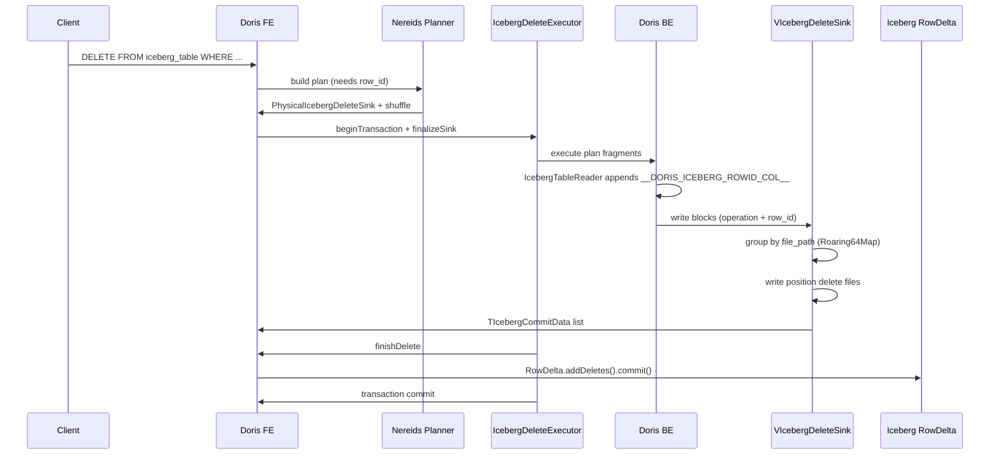

# Doris Iceberg DELETE: Principle, Flow, and Call Graph

This document describes the current Doris Iceberg DELETE implementation (position delete only),
including design goals, end-to-end flow, and code pointers.

## 1. Scope and Constraints

- Supported delete type: **Position Delete only**.
- Iceberg table format: **v2 required** (RowDelta and delete files).
- Equality delete is **not supported** in the DELETE writer path.
- The engine always emits a hidden row id column and uses it to build delete files.

## 2. Key Concepts and Data Model

### 2.1 Operation Column
Doris routes merge-style DML with an `operation` column:

- `operation` is `TINYINT`.
- Operation codes (FE):
  - `INSERT_OPERATION_NUMBER = 1`
  - `DELETE_OPERATION_NUMBER = 2`
  - `UPDATE_OPERATION_NUMBER = 3` (UPDATE rows; executor splits into delete + insert)
  - `UPDATE_INSERT_OPERATION_NUMBER = 4` (pre-split update insert rows)
  - `UPDATE_DELETE_OPERATION_NUMBER = 5` (pre-split update delete rows)

Code: `fe/fe-core/src/main/java/org/apache/doris/datasource/iceberg/IcebergMergeOperation.java`

### 2.2 Hidden Row Id Column
Doris exposes Iceberg row-id as a hidden column:

- Column name: `__DORIS_ICEBERG_ROWID_COL__` (hidden)
- Type:
  ```
  STRUCT<
    file_path: STRING,
    row_position: BIGINT,
    partition_spec_id: INT,
    partition_data: STRING
  >
  ```

Code:
- FE type definition: `fe/fe-core/src/main/java/org/apache/doris/datasource/iceberg/IcebergRowId.java`
- FE schema injection: `fe/fe-core/src/main/java/org/apache/doris/datasource/iceberg/IcebergExternalTable.java`
- BE row-id generation: `be/src/vec/exec/format/table/iceberg_reader_rowid.cpp`

### 2.3 Partition Spec Id and Partition Data JSON
- `partition_spec_id`: Iceberg partition spec id used to interpret partition values.
- `partition_data`: JSON-encoded partition values for the file.
- Both are carried with each split and embedded in row id.

Code:
- FE split propagation: `fe/fe-core/src/main/java/org/apache/doris/datasource/iceberg/source/IcebergSplit.java`
- FE scan range encoding: `fe/fe-core/src/main/java/org/apache/doris/datasource/iceberg/source/IcebergScanNode.java`
- BE reader usage: `be/src/vec/exec/format/table/iceberg_reader.cpp`

## 3. End-to-End Flow

### 3.1 SQL to Logical Plan (FE)

1. SQL entry: `DELETE FROM iceberg_table WHERE ...`
2. Nereids builds `IcebergDeleteCommand`.
3. `IcebergDeleteCommand` enables `needIcebergRowId` in `ConnectContext`.
4. Logical plan is rewritten to project:
   - `operation` (constant = DELETE)
   - `__DORIS_ICEBERG_ROWID_COL__`
5. The plan is wrapped with `LogicalIcebergDeleteSink`.

Code:
- `fe/fe-core/src/main/java/org/apache/doris/nereids/trees/plans/commands/IcebergDeleteCommand.java`
- `fe/fe-core/src/main/java/org/apache/doris/nereids/trees/plans/logical/LogicalIcebergDeleteSink.java`

### 3.2 Physical Plan and Distribution (FE)

- `PhysicalIcebergDeleteSink` requires hash distribution by:
  - `(operation, row_id)` when both are present
  - `row_id` when only row_id is found
- This requirement triggers a remote exchange (shuffle) in the plan.

Code:
- `fe/fe-core/src/main/java/org/apache/doris/nereids/trees/plans/physical/PhysicalIcebergDeleteSink.java`

### 3.3 Execution and Transaction (FE)

1. `IcebergDeleteCommand.run()` plans and creates an `IcebergDeleteExecutor`.
2. The executor opens an **external transaction** (`transactionManager.begin()`).
3. The sink is finalized to produce a valid `TDataSink` and scan ranges.
4. Coordinator executes the plan; BE returns delete commit data.
5. `IcebergDeleteExecutor.doBeforeCommit()` calls `IcebergTransaction.finishDelete()`.
6. `IcebergTransaction` converts commit data to DeleteFiles and commits via `RowDelta`.

Code:
- Executor: `fe/fe-core/src/main/java/org/apache/doris/nereids/trees/plans/commands/insert/IcebergDeleteExecutor.java`
- Transaction: `fe/fe-core/src/main/java/org/apache/doris/datasource/iceberg/IcebergTransaction.java`

### 3.4 Row Id Generation (BE)

- `IcebergTableReader` adds `__DORIS_ICEBERG_ROWID_COL__` to each block when needed.
- `file_path` comes from `original_file_path` in the split.
- `row_position` is generated using the current file offset.
- `partition_spec_id` and `partition_data` are populated from split metadata.

Code:
- `be/src/vec/exec/format/table/iceberg_reader.cpp`
- `be/src/vec/exec/format/table/iceberg_reader_rowid.cpp`

### 3.5 Delete Sink Writing (BE)

- `VIcebergDeleteSink` scans each incoming block to extract row ids.
- It groups delete positions by `file_path`.
- Each file uses a `Roaring64Map` to deduplicate row positions.
- For each data file, a position delete file is written with schema:
  `(file_path, pos)`
- Commit data is collected and returned to FE.

Code:
- Sink: `be/src/vec/sink/viceberg_delete_sink.cpp`
- Writer: `be/src/vec/sink/writer/iceberg/viceberg_delete_file_writer.cpp`

### 3.6 Commit (FE)

- FE receives `TIcebergCommitData` from BE.
- It groups by `partition_spec_id`.
- `IcebergWriterHelper.convertToDeleteFiles()` creates Iceberg `DeleteFile` objects.
- `RowDelta.addDeletes()` commits these delete files.

Code:
- `fe/fe-core/src/main/java/org/apache/doris/datasource/iceberg/IcebergTransaction.java`
- `fe/fe-core/src/main/java/org/apache/doris/datasource/iceberg/helper/IcebergWriterHelper.java`

## 4. Detailed Data Flow (Key Structures)

### 4.1 FE -> BE (Scan Range)
- `TIcebergFileDesc` includes:
  - `original_file_path`
  - `partition_spec_id`
  - `partition_data_json`
  - delete file filters (position/equality)

Code:
- `fe/fe-core/src/main/java/org/apache/doris/datasource/iceberg/source/IcebergScanNode.java`

### 4.2 BE -> FE (Commit Data)
- `TIcebergCommitData` for position deletes includes:
  - `file_path` (delete file path)
  - `file_content = POSITION_DELETES`
  - `row_count`, `file_size`
  - `referenced_data_file_path`
  - `partition_spec_id`, `partition_data_json` (if set)

Code:
- `be/src/vec/sink/viceberg_delete_sink.cpp`
- `be/src/vec/sink/writer/iceberg/viceberg_delete_file_writer.cpp`

## 5. Call Graphs

### 5.1 High-Level Call Graph

```
SQL DELETE
  -> IcebergDeleteCommand.run
     -> NereidsPlanner.plan
        -> PhysicalIcebergDeleteSink
     -> IcebergDeleteExecutor.beginTransaction
     -> IcebergDeleteExecutor.finalizeSinkForDelete
     -> IcebergDeleteExecutor.executeSingleInsert
        -> coordinator.exec
           -> BE scan + sink
        -> IcebergDeleteExecutor.doBeforeCommit
           -> IcebergTransaction.finishDelete
              -> IcebergWriterHelper.convertToDeleteFiles
              -> RowDelta.addDeletes().commit()
```

### 5.2 Sequence Diagram (FE/BE)



## 6. Remote Exchange / Shuffle

`PhysicalIcebergDeleteSink` requires hash distribution by `(operation, row_id)`.
This yields a remote exchange in the distributed plan so that rows with the same
`file_path` and `row_position` are co-located for delete file generation.

Code:
- `fe/fe-core/src/main/java/org/apache/doris/nereids/trees/plans/physical/PhysicalIcebergDeleteSink.java`

## 7. Observability and Debugging

### 7.1 BE Runtime Profile Counters
- `RowsWritten`
- `DeleteFileCount`
- `SendDataTime`, `WriteDeleteFilesTime`, `OpenTime`, `CloseTime`

Code:
- `be/src/vec/sink/viceberg_delete_sink.cpp`

### 7.2 Logs
- `VIcebergDeleteSink` logs rows and delete files written.
- `IcebergTransaction` logs when committing delete files.

## 8. Limitations and Future Work

- Only **position delete** is implemented for DELETE. Equality delete is not supported.
- The delete writer currently emits delete files under `metadata/` directory
  using the configured output path or table location.
- Partition spec evolution is handled by grouping commit data by spec id.
  Missing spec id is only allowed for unpartitioned tables.

## 9. Code Pointers (Index)

FE:
- `fe/fe-core/src/main/java/org/apache/doris/nereids/trees/plans/commands/IcebergDeleteCommand.java`
- `fe/fe-core/src/main/java/org/apache/doris/nereids/trees/plans/commands/insert/IcebergDeleteExecutor.java`
- `fe/fe-core/src/main/java/org/apache/doris/datasource/iceberg/IcebergTransaction.java`
- `fe/fe-core/src/main/java/org/apache/doris/datasource/iceberg/helper/IcebergWriterHelper.java`
- `fe/fe-core/src/main/java/org/apache/doris/datasource/iceberg/IcebergRowId.java`
- `fe/fe-core/src/main/java/org/apache/doris/datasource/iceberg/source/IcebergSplit.java`
- `fe/fe-core/src/main/java/org/apache/doris/datasource/iceberg/source/IcebergScanNode.java`
- `fe/fe-core/src/main/java/org/apache/doris/nereids/trees/plans/physical/PhysicalIcebergDeleteSink.java`

BE:
- `be/src/vec/exec/format/table/iceberg_reader.cpp`
- `be/src/vec/exec/format/table/iceberg_reader_rowid.cpp`
- `be/src/vec/sink/viceberg_delete_sink.cpp`
- `be/src/vec/sink/writer/iceberg/viceberg_delete_file_writer.cpp`
